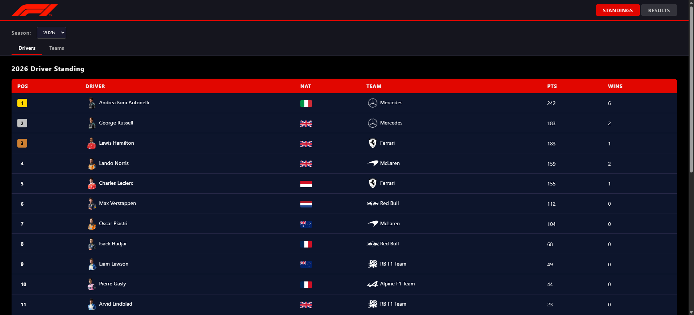
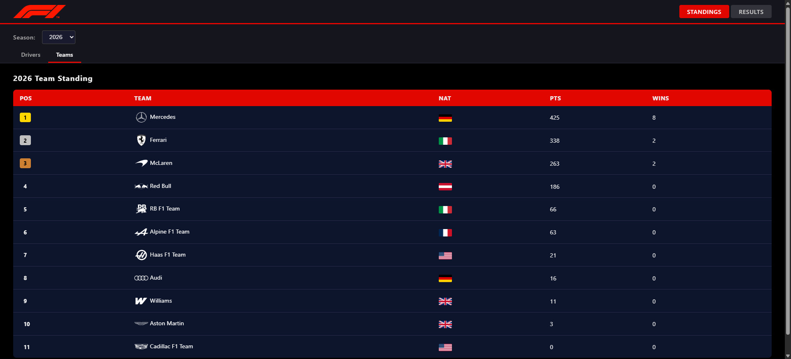
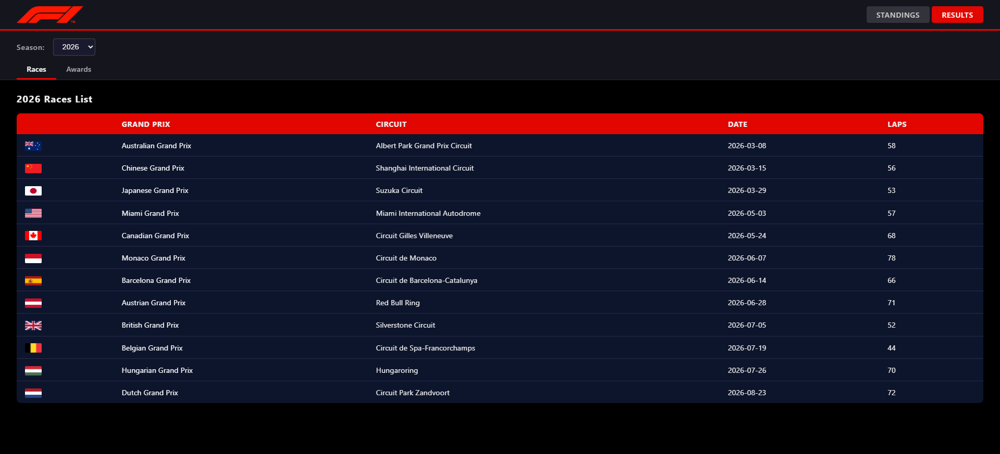
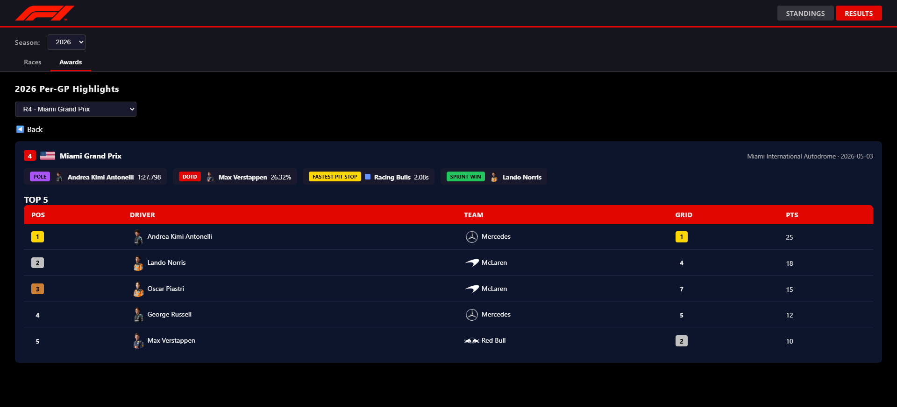

# F1 Stats API

[](./LICENSE)
[](https://www.python.org/)
[](https://fastapi.tiangolo.com/)
[](https://developer.mozilla.org/en-US/docs/Web/JavaScript)
[](https://www.docker.com/)
[](https://docs.docker.com/compose/)
[](https://github.com/wilhen199/f1-api/actions/workflows/ci.yml)
[](#-status)

A full-stack web application that aggregates Formula 1 historical and current season data — standings, race results, qualifying, sprint races, pit stops, and per-race awards — served through a FastAPI backend and a vanilla JS frontend.

---

## 📅 Status

This project is a personal learning build and is **actively in progress**.

| Area | Status |
| --- | --- |
| Backend (async fetch, caching, routers) | ✅ Done |
| Frontend (routing, standings, results, awards) | ✅ Done |
| Testing (pytest, no real network calls) | ✅ Done |
| CI/CD (GitHub Actions) | ✅ Done |
| Containerization (Docker) | ✅ Done |
| Manual AWS deployment (ECS Fargate) | 🚧 In progress |
| Automated AWS deployment (Terraform) | 📋 Planned |

> Deployments to AWS are done as hands-on practice/lab exercises and are **not kept running permanently**.

---

## 📸 What it looks like









---

## 📋 What it does

- **Driver & Constructor Standings** — championship tables for any season from 1950 to present.
- **Race Results** — full race, qualifying, and sprint results per round, with lap counts and finishing status.
- **Race Detail** — single-round view combining results, qualifying grid, sprint, pole position, Driver of the Day, and fastest pit stop.
- **Awards Summary** — per-race awards table: winner, pole, sprint winner, DOTD, and fastest pit stop for every round of a season.
- **Driver & Team Detail** — season breakdown for a specific driver or constructor, including race-by-race points and positions.
- **Photos & Flags** — official F1 portrait/logo images for current-season drivers and teams; Wikipedia photos as fallback for historical entries; country flags via flagcdn.com.

Data is sourced from two external APIs:

- [Jolpica/Ergast](https://api.jolpi.ca/ergast/f1) — historical and current F1 data (free, public).
- Official F1 website API — Driver of the Day votes and DHL fastest pit stop awards (requires API key).

---

## ⏱️ Quick Start

### 🐍 Prerequisites 🐋

- Python 3.13+
- Docker & Docker Compose (optional, but recommended)
- An API key for the official F1 website API (for Driver of the Day / fastest pit stop data)

### 🐋 Option A — Run with Docker (recommended)

```bash
git clone https://github.com/wilhen199/f1-api.git
cd f1-api

cp .env.example .env
# then edit .env and fill in your F1COM_APIKEY

docker-compose up --build
```

The app will be available at `http://localhost:8000`.

### 🌐 Option B — Run locally without Docker

```bash
git clone https://github.com/wilhen199/f1-api.git
cd f1-api/backend

python -m venv venv
source venv/bin/activate   # Windows: venv\Scripts\activate

pip install -r requirements.txt

cp ../.env.example ../.env
# then edit ../.env and fill in your F1COM_APIKEY

uvicorn main:app --port 8000 -reload
```

The app will be available at `http://localhost:8000`.

### Running tests

```bash
cd backend
pytest tests/test_f1_api.py -v
```

---

## ⚙️ Environment Variables

Copy `.env.example` to `.env` and fill in the values below.

| Variable | Required | Default | Description |
| --- | --- | --- | --- |
| `F1COM_APIKEY` | ✅ Yes | — | API key for the official F1 website API (Driver of the Day, fastest pit stops). |
| `F1COM_BASE_URL` | No | `https://api.formula1.com` | Base URL for the official F1 API. Override only if needed. |

> how to get your F1COM_APIKEY:
>
> 1. Go to <https://www.formula1.com/>
> 2. Open Browser's DevTools (F12)
> 3. Go to Network Tab and filter by api.formula1.com
> 4. Refresh the page and look for the Request Headers section
> 5. In the Request Headers section, find the `Apikey` header and copy its value (e.g., `ANaNNCYP5X5LfTP5y2S6iEzKz6kZufMy`).
>
---

## 📄API Documentation

Since the backend is built with FastAPI, interactive API docs are generated automatically — no extra setup needed. Once the app is running:

- **Swagger UI** → `http://localhost:8000/docs`
- **ReDoc** → `http://localhost:8000/redoc`

Use these to explore and test every endpoint (standings, results, awards, driver/team detail) directly from the browser.

---

## 📂 How it works

```text
Browser
  │
  │  GET /  (static files)
  ▼
┌─────────────────────────────────────────────────────┐
│                   FastAPI App                        │
│  main.py                                             │
│  ├── StaticFiles  →  frontend/ (HTML, CSS, JS)       │
│  │                                                   │
│  ├── /api/seasons                                    │
│  │                                                   │
│  ├── routers/standings.py                            │
│  │   ├── GET /api/standings/drivers                  │
│  │   └── GET /api/standings/teams                    │
│  │                                                   │
│  ├── routers/results.py                              │
│  │   ├── GET /api/races                              │
│  │   ├── GET /api/results                            │
│  │   ├── GET /api/results/season                     │
│  │   ├── GET /api/results/qualifying                 │
│  │   ├── GET /api/results/sprint                     │
│  │   ├── GET /api/results/race/{round}               │
│  │   ├── GET /api/driver/{driver_id}                 │
│  │   └── GET /api/team/{team_id}                     │
│  │                                                   │
│  └── routers/awards.py                               │
│      ├── GET /api/awards                             │
│      ├── GET /api/fastestlap                         │
│      ├── GET /api/fastestpitstops                    │
│      ├── GET /api/dotd                               │
│      └── GET /api/pitstop                            │
└──────────────────┬──────────────────────────────────┘
                   │
          helpers.py  ←  images.py
          (normalize & enrich data with photos/flags)
                   │
       ┌───────────┴────────────┐
       ▼                        ▼
  f1_api.py               f1_api.py
  _fetch() with           fastest_pit_stops()
  in-memory TTL cache     driver_of_the_day()
  + per-URL async lock    (Official F1 API)
       │
       ▼
  Jolpica/Ergast API          Wikipedia REST API
  (races, results,            (fallback photos for
   standings, etc.)            historical drivers/teams)
```

## Caching strategy

`f1_api._fetch()` implements a **double-checked locking** pattern:

1. Fast path — return immediately if the URL is already cached and fresh (TTL: 1 hour).
2. Acquire a per-URL `asyncio.Lock` to prevent duplicate concurrent requests for the same resource.
3. Re-check the cache inside the lock before hitting the network.

`images.PhotoService` applies the same pattern for Wikipedia photo lookups, with an additional **disk cache** (`cache/photos.json`) that survives process restarts.

---

## 🚀Best practices covered

| Area | What's implemented |
| --- | --- |
| **Async I/O** | All network calls use `httpx.AsyncClient`; concurrent fetches use `asyncio.gather` |
| **Caching** | In-memory TTL cache with double-checked locking; disk-persisted photo cache |
| **Rate-limit handling** | 429 responses from Ergast propagate a proper `Retry-After` header to the client |
| **Separation of concerns** | Data fetching (`f1_api`), normalization (`helpers`), media resolution (`images`), routing (routers) are fully decoupled |
| **Configuration** | Single `config.py` for shared values; secrets via `.env` / `python-dotenv` |
| **Containerization** | Multi-stage-friendly `Dockerfile` with `python:3.13-slim`; `docker-compose.yml` for local orchestration |
| **CI/CD** | GitHub Actions pipeline: build image → start container → health-check → run tests → teardown |
| **Testing** | Unit tests with monkey-patched `_fetch` — no real network calls; covers pagination, edge cases, and empty responses |
| **HTTP best practices** | Custom `User-Agent` header on all outbound requests; `follow_redirects=True` |
| **API design** | Versioned prefix (`/api`), tagged routes, query-param defaults, proper 404 responses |

---

## Show your support by adding a ⭐ to this repo

## 📌Next steps — Automated AWS deployment with Terraform

- 🚧 Manual deployment to AWS (ECS Fargate) — hands-on lab, not permanently hosted.
- 📋 Automated deployment to AWS with Terraform (VPC, ECS, ALB, Secrets Manager, IAM) — hands-on lab, not permanently hosted.

---
